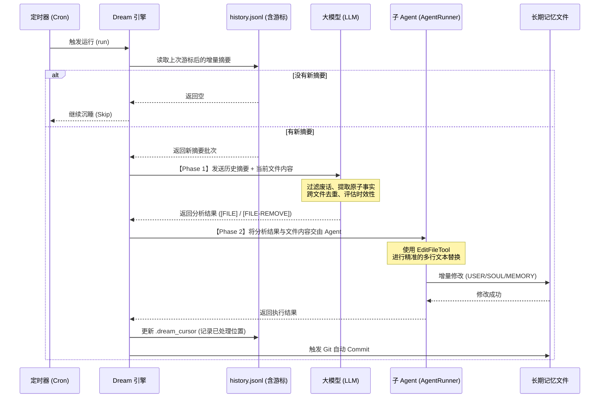

# Nanobot 记忆系统深度解析与演进展望

## 1. 记忆系统架构：多级分层设计

Nanobot 的记忆系统采用了一种非常优雅且轻量级的“多级分层架构”，旨在解决大模型（LLM）上下文窗口有限与长期记忆需求之间的矛盾。整个系统由三个核心环节构成：

```mermaid
graph TD
    User((用户)) <--> |日常对话| Session[短期工作记忆<br>Session Messages]
    
    subgraph 阶段一: 上下文压缩 (Consolidator)
    Session -- Token逼近上限 --> Consolidator{压缩器}
    Consolidator -- 提取关键信息 --> LLM_Summary[LLM 摘要生成]
    LLM_Summary -- 追加写入 --> History[(中期记忆<br>history.jsonl)]
    end

    subgraph 阶段二: 深度睡眠巩固 (Dream)
    Cron((定时任务)) --> Dream_Trigger[唤醒 Dream]
    Dream_Trigger -- 根据游标读取增量 --> History
    History --> Phase1[Phase 1: 分析与去重]
    Phase1 --> Phase2[Phase 2: 外科手术式编辑]
    end

    subgraph 阶段三: 长期记忆存储 (Persistent)
    Phase2 -- 更新偏好 --> USER[USER.md<br>用户画像]
    Phase2 -- 更新规范 --> SOUL[SOUL.md<br>AI 人设]
    Phase2 -- 更新知识 --> MEMORY[MEMORY.md<br>项目上下文]
    end
```

### 1.1 短期记忆（工作记忆）：`Session`
*   **机制**：保存用户与 AI 之间原汁原味的、逐句的聊天记录。这是最高保真的数据，包含完整的内部元数据（如时间戳、图片占位符、工具调用等）。
*   **作用**：保证当前任务的上下文绝对连贯，让大模型在当前会话中拥有精准的短期响应能力。
*   **清理**：当单文件无限制膨胀时，会触发硬性物理截断（`enforce_file_cap`），防止内存和磁盘爆炸。

### 1.2 中期记忆（事件梗概）：`Consolidator` 与 `history.jsonl`
*   **机制**：当当前会话的 Token 数量逼近大模型上下文上限时，`Consolidator` 会被触发。它会截取最老的一批对话，利用 LLM 将其提炼为简短的**摘要（Summary）**，并追加写入到 `history.jsonl` 文件中。
*   **作用**：这是一种“有损压缩”，通过将具体的对话转化为模糊的事件印象，在释放宝贵 Token 预算的同时，保留了历史对话的核心脉络。

### 1.3 长期记忆（深度睡眠巩固）：`Dream` 机制
*   **机制**：后台定时任务（或手动命令）触发的异步整合机制。它通过**游标（Cursor）**读取尚未被处理过的 `history.jsonl` 增量摘要，进行两阶段（Two-Phase）处理：




    *   **Phase 1 (分析)**：分析历史摘要，提取新的原子事实，并对现有知识库进行去重和“过时（Staleness）”判定。
    *   **Phase 2 (执行)**：唤起携带读写工具的子 Agent，以外科手术式的精准度（Surgical Edits）增量修改长期记忆文件。
*   **存储载体**：
    *   `USER.md`：用户画像与偏好（永久记忆，权重最高）。
    *   `SOUL.md`：AI 自身的行为规范与性格（永久记忆）。
    *   `MEMORY.md`：项目上下文与知识踩坑记录（动态记忆，受时间衰减影响）。

---

## 2. 认知科学视角的隐喻

这套机制完美映射了人类大脑的记忆流转过程：
*   **Session -> history.jsonl**：如同**“短期工作记忆向中期记忆转化”**。我们不会记住一天中说的每一句原话，而是将其压缩成一个事件梗概存放在脑海中。
*   **Dream 的游标读取**：如同**“睡眠前的信息整理”**，只针对今天发生的新事情进行回顾，极大地降低了认知负担。
*   **Dream 的两阶段写入**：如同**“深度睡眠期间的记忆巩固（Memory Consolidation）”**。在梦境中进行批判性思考，忘掉琐事、合并重复、抛弃过时状态，最终提炼出指导未来行为的“结晶”存入大脑皮层（USER/SOUL/MEMORY）。

---

## 3. 局限性反思：信息流失与幻觉风险

尽管设计精妙，但在实战与理论推演中，这套基于“两层过滤（Summarize -> Dream）”的机制暴露出了一些结构性的局限。

### 3.1 细节丢失与“记忆漂移（幻觉）”
*   **双重有损压缩**：第一层将对话压缩为摘要，丢弃了具体代码和思考转折；第二层再从摘要中提取“原子事实”。
*   **传话游戏效应**：在这个过程中，由于缺乏原始语境，大模型极易将基于特定场景的权宜之计，错误地缝合、放大成一个全局的“用户偏好”，产生记忆漂移和幻觉。

### 3.2 缺乏“长时间连续总结规律”的能力
当前的机制是**“切片式、增量式（Incremental）”**的处理方式，导致它面临以下盲区：
*   **只见树木不见森林**：每次只看一小批增量摘要，无法纵览几个月的数据，因此无法发现跨时间周期的深层规律（例如隐性的编程风格偏好、长期的抱怨模式）。
*   **因果链断裂**：相隔数周的事件（如之前的配置修改与今天的报错）由于早期的记录已被压缩或剔除，Dream 无法建立起长期的因果关联。
*   **依赖显性表述**：目前的提示词强烈依赖大模型去寻找明确的“决定”或“方案”，极度不擅长通过统计学意义上的模式识别来捕捉隐性规律。

---

## 4. 总结与未来展望

Nanobot 当前的 `Consolidator` + `Dream` 记忆系统，其本质并不是为了“做长周期的科研规律挖掘”，而是一个极度实用的**“备忘录（Cheat Sheet）系统”**。它的核心商业价值在于：**防止用户每天重复交代基础背景（我是谁、我在做什么项目），从而提供极其丝滑的日常沟通体验。**

如果要突破现有的局限，让系统真正具备“基于连续历史信息总结深层规律”的能力，未来的架构演进可能需要引入新的记忆范式：

1.  **向量数据库（RAG）**：保留高保真原文或一层摘要，将其 Embedding 化。遇到复杂问题时，通过相似度检索跨越时间线拉取所有相关历史，交给大模型进行宏观分析。
2.  **图数据库记忆（Graph Memory）**：将概念、事件、代码模块抽象成图结构节点，以此来保存复杂的因果关系，取代目前干瘪的线性 Markdown 文本。
3.  **宏观反思机制（Macro-Reflection）**：超越每日的微观增量 Dream，定期（如每月）将长周期的 `history.jsonl` 及 Git 提交记录，倾倒给支持超大上下文（如 100k+ Tokens）的模型，在不丢失细节的前提下进行深度模式识别与规律提炼。

**结语**：Nanobot 的多级记忆架构在性能与实用性之间找到了一个极佳的平衡点，而对长期连续规律总结的渴望，指明了下一代 AI 记忆系统向 RAG 与图结构演进的必然方向。